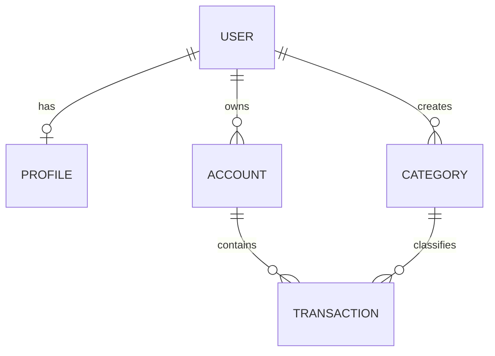

# 3. Banco de Dados

## 3.1 Diagrama de Entidade e Relacionamento (ER)

O diagrama abaixo ilustra a relação entre as principais entidades do sistema.

## 3.2 Descrição dos Models

- **USER**: Armazena as informações de autenticação do usuário, estendendo o `User` model padrão do Django.
  - `id`, `email`, `password`, `is_active`, `date_joined`, `last_login`

- **PROFILE**: Contém dados adicionais do usuário.
  - `user` (FK), `full_name`, `phone`, `created_at`, `updated_at`

- **ACCOUNT**: Representa as contas bancárias do usuário.
  - `user` (FK), `name`, `bank_name`, `account_type`, `balance`, `is_active`, `created_at`, `updated_at`

- **CATEGORY**: Usada para classificar as transações.
  - `user` (FK), `name`, `category_type` (entrada/saída), `color`, `created_at`, `updated_at`

- **TRANSACTION**: Registra as movimentações financeiras.
  - `account` (FK), `category` (FK), `transaction_type`, `amount`, `transaction_date`, `description`, `created_at`, `updated_at`
